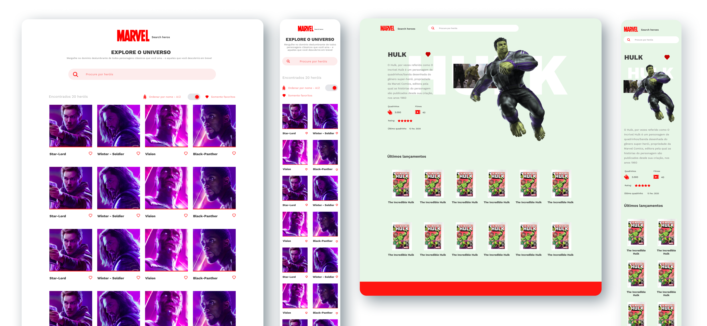

<!-- Logo -->
<p align="center">
  
</p>

<!-- Badges -->
<p align="center">
  <a href="https://thiagosalome.github.io/dragon-crypt/dist/" target="_blank">
  
  
  
  
</p>

<!-- Indice-->
<p align="center">
 <a href="#computer-sobre">Sobre</a> •
 <a href="#gear-funcionalidades">Funcionalidades</a> •
 <a href="#wrench-tecnologias-utilizadas">Tecnologias</a> •
 <a href="#art-layout">Layout</a> •  
 <a href="#movie_camera-preview">Preview</a> •
 <a href="#rocket-executando-o-projeto">Executando</a> •
 <a href="#memo-licença">Licença</a>
</p>

## :computer: Sobre

O **Marvel Search Heroes** foi um projeto criado utilizando a [api da Marvel](https://developer.marvel.com/). Seu principal objetivo é apresentar informações de todos os personagens criados pela empresa. Além disso, o usuário pode salvar até 5 personagens nos favoritos.

## :gear: Funcionalidades

- [x] Listagem de personagens
  - [x] Exibição de todos os personagens retornados pela API
  - [x] Ordenação de personagens por nome e data de modificação
  - [x] Busca de personagens por nome
  - [x] Funcionalidade de favoritar/desfavoritar até 5 personagens
  - [x] Listagem dos personagens favoritos
- [x] Visualização dos detalhes do personagem
  - [x] Informações específicas como descrição, total de quadrinhos e eventos, e data do último quadrinho lançado
  - [x] Listagem dos últimos quadrinhos lançados do personagem

## :wrench: Tecnologias Utilizadas

<table>
  <tbody>
    <tr>
      <td align="center">
        
        <p>HTML</p>
      </td>
      <td align="center">
        
        <p>Typescript</p>
      </td>
      <td align="center">
        
        <p>React</p>
      </td>
      <td align="center">
        
        <p>Styled Components</p>
      </td>
    </tr>
  </tbody>
</table>

## :art: Layout

### Web - [Figma](https://www.figma.com/file/GOEHs2bPIPU21XnPz1Xkmp/Marvel-Search-Heroes?node-id=62%3A30)



## :movie_camera: Preview

### Web


## :rocket: Executando o projeto

### Pré-requisitos

Para executar o projeto é necessário ter instalado as seguintes ferramentas:

<table>
  <tbody>
    <tr>
      <td align="center">
        <a href='https://git-scm.com/downloads' target='_blank'>
          
          <p>GIT</p>
        </a>
      </td>
      <td>
        <a href='https://git-scm.com/downloads' target='_blank'>
          
          <p>Node.js</p>
        </a>
      </td>
    </tr>
  </tbody>
</table>

### Rodando aplicação web

```bash
# Clone este repositório
$ git clone https://github.com/thiagosalome/marvel-search-heroes

# Acesse a pasta do projeto no seu terminal/cmd
$ cd marvel-search-heroes

# Instale as dependências
$ npm install

# Crie um arquivo .env.development.local
$ touch .env.development.local

# Dentro do arquivo configure a variável de ambiente referente a apikey disponilizada pela api da Marvel em https://developer.marvel.com/

# REACT_APP_API_KEY=[sua chave de api]

# Execute a aplicação em modo de desenvolvimento
$ npm run start

# A aplicação será aberta na porta:3000 - acesse http://localhost:3000
```

## :memo: Licença

Este projeto esta sobe a licença [MIT](./LICENCE).
